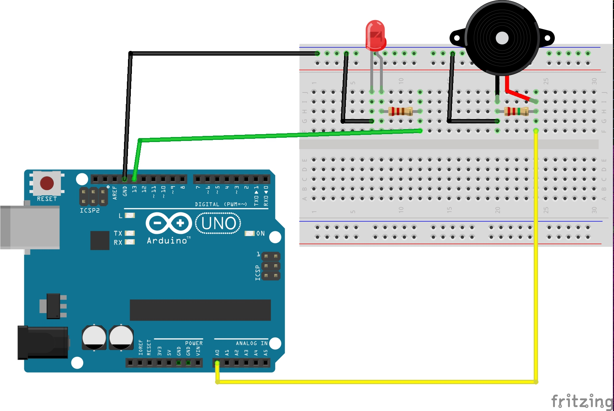

# Piezoelectric sensor

----
### HARDWARE

- Arduino

- Piezoelectric disk

- LED

- 220ohms resistor (red-red-brown)
  
- 2.2M resistor (red-red-green) (you can change this resistor to adapt sensor-sensitivity)


----
### WIRING



----
### CODE and INSTRUCTIONS

- Upload the following code to your Arduino Board (or download here)

```
int sensorOutput = A0; // Analog pin connected to the sensor

int LED = 13; // Pin connected to LED

int THRESHOLD = 10;

void setup() {
  Serial.begin(9600);
  pinMode(LED, OUTPUT);   // Set the LED pin as output

}

void loop() {

  int value = analogRead(sensorOutput);  // Read analog voltage from sensor
  Serial.println(value);

  if (value > THRESHOLD){

    digitalWrite(LED, HIGH);

  } else{

    digitalWrite(LED, LOW);
  }

```


delay (100);
}
